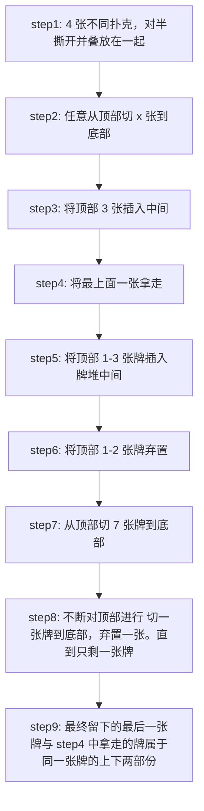
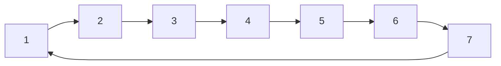
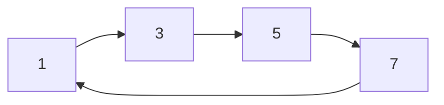
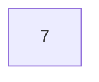
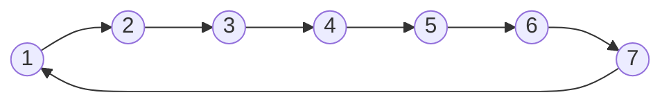
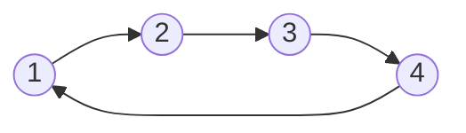

# 卡牌魔术与约瑟夫环问题

## 前言

春晚节目中卡牌魔术《守岁共此时》，虽然已经很久没看春晚，但拜年刷到重播，感到有点意思，稍微想了想

## 魔术流程

## 分析

1. 不妨我们将撕开后叠放的两两对应的序列使用 $ABCD-ABCD$ 进行描述
2. 在 step2 中切 x 次并不会打乱原有的序列  
   如切 1 次时，所得序列为 $BCDA-BCDA$  
   如切 2 次时，所得序列为 $CDAB-CDAB$  
   与原来序列 $ABCD-ABCD$ 等价，是魔术师的障眼法
3. 在step3 将顶部 3 张插入中间后，得到的序列为 $DXXX XXXD$（X为无关牌）。魔术的关键在于此时我们拿走的**顶部的牌，与底部最后一张牌此时是相对应的**
4. step5 切牌由于不会涉及到最后一张牌，并不会影响最底部的对应卡牌 D，障眼法
5. step6 和step7 对牌进行了变换，这个变换暂时不分析，是将对应卡牌 D切到某一特定位置
6. step9 进行切一张牌到底部，弃置一张，我们可以看作是不断进行在一个环中**间隔位置**的消除,直到剩下最后一张

>如 刚开始时有数字序列 $1234567$ ,对应位置从 1**开始位置编为 0** ，间隔为 1 进行消除数字 2、4、6,此时得到的序列如下

>此时一轮过后，数字序列为  $1357$ ，因为上一轮数字 7 被保留，因此这一轮消除数字1、5，直到只留下一个数字

这是一个约瑟夫环问题，我们需要对其稍微进行分析

### 约瑟夫环

>假设有 n 个人围坐成一个环，第一个人从 0 开始编号，报 M 的将被杀掉，下一个人接着从1开始报。如此反复，最后剩下一个，求最后的生还者  

我们以 M 为 1 为例  

当 n = 1 时，生还者为 0 位置

当 n = 2 时，生还者为 0 位置

当 n = 4 时，生还者为 0 位置

当 n = 8 时，生还者为 0 位置  

* 递推不难证明，当 $n = 2^a \quad (a >= 0)$,此时生还者位置为 0  
  
* 而当 $2^{(a-1)} \leq n < 2^a\quad (a > 0)$ 时，我们可以先进行 $n-2^{(a-1)}$ 次消除人数，转换成  $n = 2^{(a-1)} \quad (a > 0)$ 的情况

综上分析，在 M 为 1 的情况下，最后生还者的位置为
$$Y = 2 \cdot (n - 2^{(a-1)}) \qquad 2^{(a-1)} \leq n < 2^a$$

由上可知，当牌的数量确定时，经过不断的切一张牌到底部，弃置一张，直到仅剩一张牌时，该牌位置可由上述公式求得，在 step6 和step7 中，就是将位于最后的目标牌切到对应位置

### 切牌位置变化

设共有 n 张牌，在将一张牌由顶部切置最底部时，重复 a次 ，位置 $X$ 牌变化后位置关系可由得出
$$Z= (X-a)\mod n$$  

>例如当 n 为7时，

>当 a = 1 时

>当 a = 2 时

### 综合分析

当 在 step6 中丢弃 1 张牌时，此时 n = 6，以圆代表最终对应的牌，位置由 0 开始编号

此时数字 6 位置为 5 ,经过 step7 置换后，根据 $Z= (X-a)\mod n$ 变换得到的位置为 4

而根据约瑟夫环问题我们可以知道，最终保留下牌位置为 $Y = 2 \cdot (n - 2^{(a-1)}) \qquad 2^{(a-1)} \leq n < 2^a$ ，即 $Y = 2 \cdot (6 - 2^{(3-1)})=4$，所以最终魔术成功，丢弃 2 张时易证得相同结果

## 总结

共有 n 张牌，且目标牌在底部，  
当丢弃顶部 $m$ 张牌时，目标牌位置为 $n-m-1$ 此时 $m \lt n$,经过 n 次将顶部的一张牌切到底部后，目标牌变换后位置为  
$$Z = ((n - m - 1) - n) \mod (n - m)=(-m-1) \mod (n-m)$$
再进行切一张牌到底部，弃置一张，直到仅剩一张牌时，保留牌的位置为
$$Y = 2 \cdot ((n-m) - 2^{(a-1)}) \qquad 2^{(a-1)} \leq n-m < 2^a$$

可以检验得，当 n 取7时，  
m取 1，2，3 ,5 ,6时 $Z=Y$，魔术成功
